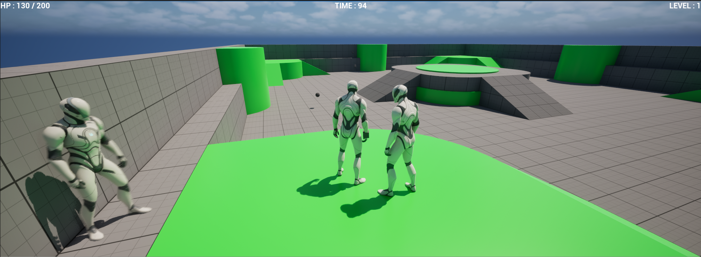
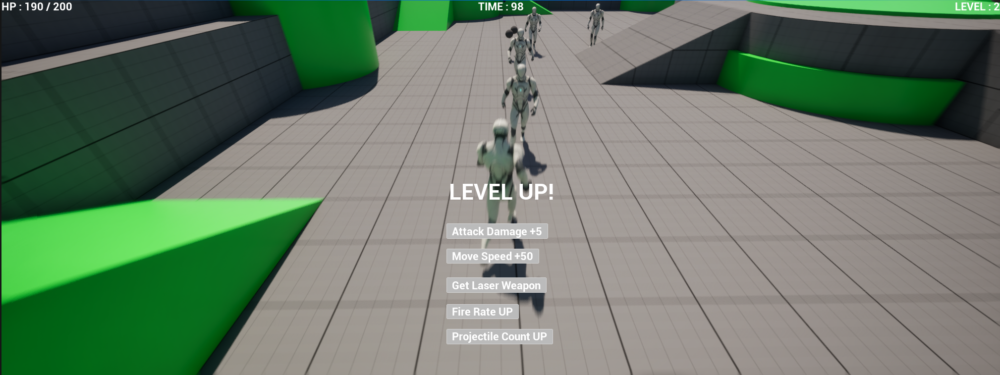
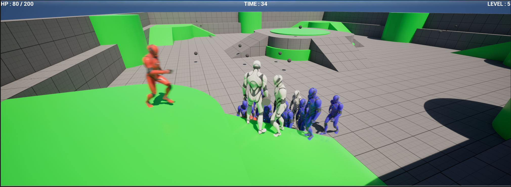
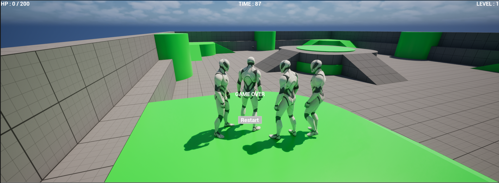

# Project Survivor

> 🎮 Unreal Engine 5.8 と C++ を用いて制作した3Dサバイバルアクションゲーム

ゲームプログラマーへの転職を目指して制作した個人開発作品です。
---

# タイトル画面

---

# ゲーム概要

Project Survivor は、Unreal Engine 5.8 と C++ を用いて制作した3Dサバイバルアクションゲームです。

プレイヤーは四方から出現する敵を倒して経験値を獲得し、レベルアップによる能力強化を行いながら一定時間生き残ることを目的としています。

本作品はゲームプログラマーへの転職を目指して制作した個人開発作品であり、C++を中心としたゲームロジックの実装やBlueprintとの連携、Gitを用いたソース管理など、実践的なゲーム開発を意識して取り組みました。

---

# ゲームプレイ

プレイヤーは敵の攻撃を避けながら自動攻撃で敵を倒します。

画面上部には

- HP
- TIME
- LEVEL

を表示し、ゲーム状況を確認できるようにしています。

---

# レベルアップシステム

敵を倒して経験値を獲得するとレベルアップします。

レベルアップ時には以下のような能力強化を実装しました。

- Attack Damage UP
- Move Speed UP
- Fire Rate UP
- Projectile Count UP
- Laser Weapon取得

---

# 戦闘

時間経過とともに敵の数が増加し、プレイヤーは多数の敵に囲まれながら戦います。

敵AIやスポーン処理、プレイヤーのHP管理などを実装しています。

---

# ゲームオーバー

HPが0になるとゲームオーバー画面を表示し、リスタートできるよう実装しています。

---

# 実装機能

- プレイヤー移動
- 敵AI
- 敵スポーンシステム
- 自動攻撃
- レベルアップシステム
- ステータス強化
- レーザー武器追加
- HP管理
- ゲームオーバー
- リスタート
- UMGによるUI
- タイトル画面

---

# 使用技術

|分類|内容|
|---|---|
|Engine|Unreal Engine 5.8|
|Language|C++|
|Visual Script|Blueprint|
|UI|UMG|
|IDE|Visual Studio 2022|
|Version Control|Git / GitHub|

---

# 開発で工夫した点

## C++とBlueprintの役割分担

ゲームロジックはC++で実装し、画面表示や調整しやすい部分はBlueprintを利用することで保守性を意識しました。

## 段階的な実装

一度にすべて実装するのではなく、

- プレイヤー
- 敵
- UI
- レベルアップ
- タイトル画面

というように機能単位で開発を進めました。

## Gitによるバージョン管理

機能追加ごとにコミットを行い、変更履歴を管理しながら開発しました。

---

# 苦労した点

制作中には

- レベルアップ処理
- 敵スポーン制御
- UI更新
- 初回起動時のエラー
- Git管理

などで問題が発生しました。

その都度原因を調査し、一つずつ修正・動作確認を行いながら開発を進めました。

---

# この作品で学んだこと

- Unreal Engine 5 におけるゲーム開発
- C++とBlueprintの使い分け
- オブジェクト指向を意識したクラス設計
- Gitを利用したソースコード管理
- 機能追加・デバッグを繰り返しながら完成まで開発する流れ

---

# 今後改善したい点

- エフェクト追加
- サウンド追加
- マップ追加
- 武器追加
- UI改善
- セーブ機能

---

# 制作期間

約0.5か月（※実際の期間を記載）

---

# 作者

Shuto Tanazawa
